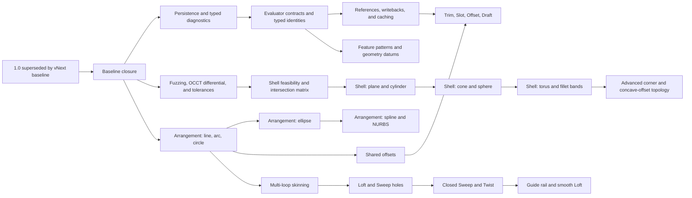

# ZeroCAD capability, robustness, and architecture roadmap

## Status and release boundary

This is the execution roadmap for the next ZeroCAD capability cycle. The Part
Design 1.0 candidate is explicitly superseded by vNext at commit
`71acd92e1ee152fcd64daa5c91bedd1b8d5cb270`. No release branch or tag is created
for that candidate. Existing published commits and tags remain unchanged, and
affected evidence is reset against this named vNext baseline.

The earlier Part Design 1.0 contract and open external evidence remain in
`part-design-master-plan.md` and `phase7-completion.md` as historical records;
they are not active vNext release gates.

### Implementation status - 2026-07-18

- The authoritative vNext baseline is ZeroCAD/OpenRCAD commit
  `71acd92e1ee152fcd64daa5c91bedd1b8d5cb270`. The intervening commits after the
  previous recorded baseline contain release and CI infrastructure only.
- The Part Design 1.0 candidate is explicitly superseded. No release branch or
  tag is created, and published history is not rewritten.
- Gate 0 and Foundations 1A-1E are implemented as 27 bisectable commits after
  the named baseline. `.zcad` v5 framing, v1 payload bytes, published tags, and
  serialized identifier strings remain unchanged.
- Foundation 1A owns version-aware two-phase payload decoding and typed
  diagnostics. Behavioral tests assert codes and parameters; a small renderer
  suite owns exact English copy. Synthetic multi-schema coverage uses an
  injected test-only decoder table rather than a fictional persisted schema.
- Foundation 1B uses candidate evaluator contracts, typed feature/body
  identities, a single orchestrator transaction boundary, self-healing node
  maps, isolated mesh support, and parsed durable topology names. Every migrated
  family has cold/warm, cancellation, rollback, and lifecycle coverage.
- Foundation 1C reprojects durable references, suspends missing names, stages
  explicit legacy backfill, separates geometry and diagnostic cache
  dependencies, traces checkpoint/tessellation reuse, binds writebacks to
  document revisions, and preserves both whole-document and working-sketch undo.
- Foundation 1D provides canonical Boolean cases, deterministic Windows replay,
  WSL2/nightly fuzz lanes, derived tolerance contexts, scale/aspect/far-origin
  sweeps, recovery certificates, and an explicit release-unwind guard. The
  property sweeps landed in the same commit as removal of the unit-scale floor.
- Foundation 1E provides provenance-bearing analytic arrangements, typed staged
  ellipse/spline support, a shared material offset engine, and hole-aware
  deterministic Loft/Sweep skinning.
- ZeroCAD formatting, check, full tests, and core clippy complete successfully.
  Foundation 1 introduced no new clippy warnings; the previously reviewed
  advisory backlog remains. The nested OpenRCAD formatting, locked check, and
  locked workspace tests also complete successfully.
- Gate 0's first semantic golden is committed in
  `zerocad-core/tests/fixtures/semantic/vnext-baseline-v1.json`. Its comparator
  freezes document/output structure exactly, derives geometry tolerances from
  the OpenRCAD standard policy, and deliberately excludes triangle order and raw
  mesh buffers.
- The release-mode modeling percentile gate is implemented for the existing
  Lenovo 82XU (Ryzen 7 7840HS, 16 GiB, Windows 11, Rust 1.94). It enforces five
  warmups, 31 samples, nearest-rank p50/p95, AC power, and the effective **Best
  performance** overlay. Smoke output is marked non-evidence. Decision
  2026-07-20: no committed reference baseline will be captured for this
  tranche; the profiler and its thresholds remain available for on-demand
  runs, and any future performance evidence claim must first record a
  reference run under the documented conditions.

## Delivery principles

- Preserve `.zcad` v5 framing and serialized identifier strings.
- Decode feature payloads by `(kind_id, payload_schema)`. Older schemas are
  supported only by explicit decoders; unknown newer schemas fail atomically.
- Upgrade supported old payloads into the current in-memory representation and
  write only the current schema on the next explicit save.
- Treat OpenRCAD operation results as candidates until strict topology,
  pcurve, history, geometry, and checked-tessellation validation passes.
- Unsupported, ambiguous, cancelled, or invalid work leaves the previous valid
  document and body state unchanged.
- Keep preview/background evaluation non-authoritative. Writebacks commit only
  against the document revision that produced them.
- Compare semantic behavior exactly and B-Rep geometry with policy-derived
  tolerances. Never use raw display-mesh floats or triangle order as
  cross-build geometry identity.
- Land foundations as narrow, independently verified slices. Research work is
  never hidden inside a feature acceptance gate.

## Dependency map

## Gate 0 - Close and record the baseline

- Record the exact ZeroCAD/OpenRCAD commit used by vNext and the explicit
  supersession of the former 1.0 candidate.
- Preserve the renamed-test correction and stale GUI wording cleanup.
- Apply normal formatting to the four files currently reported by rustfmt.
- Run the ZeroCAD and OpenRCAD workspace gates.
- Record the current capability inventory, including cylindrical, conical, and
  spherical direct edits and disconnected-cut splitting.
- Generate the first semantic golden manifest and comparator self-tests.
- Name the benchmark corpus, reference hardware, and p50/p95 procedure for the
  50 ms trailing-edit and 250 ms representative-rebuild targets.

Exit gate: formatting, checks, and tests pass; the baseline commit and release
disposition are recorded; no repair epic remains hidden in Wave 1.

## Foundation 1A - Persistence and diagnostics

1. Give every feature registry entry a current payload schema and an explicit
   ordered set of supported decoders.
2. Dispatch inline and required-asset payloads by `(kind_id, payload_schema)`.
3. Reject unknown kinds, unsupported older schemas, and unknown newer schemas
   before constructing a partial graph.
4. Decode supported historical payloads into the current `FeatureType` and
   normalize the in-memory feature record to the current schema.
5. Replace exact warning-text contracts with typed diagnostic codes and stable
   parameters. Rendered messages remain separately tested UI copy.
6. Add migration tests for every real schema transition. Do not invent a
   historical schema solely to exercise the mechanism.

Exit gate: all current v1 payloads remain byte-stable; registry dispatch and
rejection tests pass; the first future v2 can add a decoder without changing
the container reader.

## Foundation 1B - Evaluator, identities, and naming

1. Introduce internal `FeatureEvalContext` and `FeatureEvalResult` contracts.
   Results contain candidates, topology history, typed diagnostics, timings,
   and revision-bound writebacks. Only the orchestrator commits.
2. Keep scheduling, cancellation, checkpoint selection, candidate validation,
   status recording, and atomic commit in the orchestrator.
3. Migrate one feature family per change: Revolve, Loft/Sweep, Shell/Hole,
   Pattern/Transform, Thread, then remaining direct/body operations.
4. Move coplanar merging, union-find, suppression, and display cleanup into a
   mesh-support module without changing geometry semantics.
5. Complete `FeatureId` and `BodyId` adoption in node maps, attachments,
   targets, live-body maps, statuses, and writebacks while keeping serialized
   strings compatible.
6. Extend the existing parsed `TopoName` grammar to every durable producer,
   including Import, Revolve, Loft, Sweep, Shell, direct edits, and legacy
   Pattern occurrences. Unknown strings remain lossless but non-durable.

Each feature migration must pass cold/warm equivalence and its focused geometry
tests before the next family moves.

## Foundation 1C - References, caching, and undo

### Durable references

- Reproject live named faces for Extrude, Revolve, Loft sections, and Sweep
  profiles. Stored outlines are preview/legacy fallback, not authoritative
  geometry.
- A missing durable name suspends its consumer. Only genuinely unnamed legacy
  references may use geometric matching.
- Legacy backfill replays the historical body immediately before the consumer,
  queues only unique matches, and commits only on an explicit authoritative
  migration/save. Ambiguous references remain unnamed with diagnostics.

### Consumer-aware caching

- Declare dependencies from expressions, transitive variables, solver
  dimensions, sketch operations, datums, semantic inputs, attachments,
  projected boundaries, selected regions, and reattachment outcomes.
- Dependency declaration is conservative and explicit; it is not inferred from
  whichever control-flow branch happened to execute.
- Separate geometry checkpoints from diagnostic/status dependencies so an
  unused variable edit cannot return stale messages while reusing geometry.
- Add mutation tests that change every persisted field and compare warm output
  with a cache-free rebuild.

### Undo and writebacks

- Keep the 50-entry whole-document snapshot model.
- Clone authoritative recipe and presentation state without evaluation or
  region caches.
- Give active sketch operations their own working snapshots, including Trim,
  Offset, and Pattern.
- Reject writebacks from stale background revisions.

## Foundation 1D - Kernel verification and tolerance policy

### Canonical Boolean cases

Add `BooleanCaseV1`, shared by fuzz decoding, deterministic Rust replay, the
Python OCCT runner, and the structured shrinker. Define canonical field order,
finite-number rules, negative-zero normalization, and exact IEEE-754 or integer
encoding before computing the SHA-256 case identity. JSON is a readable derived
artifact, not an underspecified hash format.

Start with analytic primitives and transforms. Add a second corpus for
history-bearing extrusions, imported B-Reps, and mixed analytic topology so
primitive-only coverage does not become the robustness ceiling.

### Fuzz and differential lanes

- `boolean_safety`: broad valid inputs where documented typed failures are
  allowed.
- `boolean_resolvable`: clean constrained intersections where both engines
  should succeed.
- Keep Python/OCCT out of the libFuzzer hot loop. Promote minimized findings
  through canonical JSON, a structured shrinker, an OCCT observation, and an
  ordinary deterministic Rust regression.
- Run active fuzzing and live OCP 7.8.1.1 differential testing on pinned Ubuntu
  x86-64/nightly. WSL2 is the supported Windows workflow; native MSVC fuzzing
  is unsupported.
- Stable Windows/Linux/macOS CI replays every promoted regression without
  requiring OCCT.

### Tolerances

- Introduce nonserialized `ToleranceContext` derived from `TolerancePolicy`,
  operation bounds, local feature size, and numeric conditioning.
- Test uniform scale over `1e-3..1e3`, extreme aspect ratios, small features on
  large bodies, and translation far from the origin. One global scale scalar is
  not sufficient.
- Normalize rolling-ball convergence, make mesh welding policy-aware, audit
  planar Shell quantization, and remove Boolean helpers' artificial `1.0`
  minimum scale.
- Require semantic recovery certificates for dipped Join and expanded Cut;
  ambiguous proof rejects the fallback atomically.

## Foundation 1E - Analytic sketch and skinning stages

### Arrangement A1 - Lines, arcs, and circles

- Add `Curve2d` and `CurveSpan { source_entity, t0, t1 }`.
- Carry spans through splitting and DCEL half-edges.
- Partition collinear overlaps and coincident circular spans.
- Build B-Rep wires directly from analytic spans; tessellation remains for
  display, picking, containment, and acceleration.

### Arrangement A2 - Ellipses

- Add exact line/ellipse cases and tolerance-controlled root isolation for
  ellipse/ellipse and ellipse/circle pairs.
- Preserve provenance and deterministic tangency handling.

### Arrangement A3 - Splines and NURBS

- Add staged curve-family pairings with typed unsupported cases.
- Do not block the A1-based usability release on general NURBS/NURBS
  arrangement.
- **Known limitation:** parabola and hyperbola spans are not yet lifted into
  analytic B-Rep wires. The analytic builder declines those spans and ZeroCAD
  uses its existing sampled modeling fallback. Native analytic lifting is
  deferred beyond Foundation 1E.

### Shared offsets and skinning

- Offset connected line/arc/circle chains and material regions using exact
  parallel/concentric curves, deterministic joins, winding-aware direction,
  and arrangement cleanup.
- Return typed collapse, topology-change, branch, gap, and ambiguity failures.
- Add `SectionLoops { outer, holes }`, caps with inner wires, correctly oriented
  hole walls, and deterministic hole matching. Reordered holes are a required
  regression; ambiguous correspondence is unresolved.

## Wave 2 - vNext usability milestone

### Trim

Ship lines/arcs/circles first, then ellipse and spline support as their
arrangement stages pass. Hover previews the exact removable span; every click
is one working-sketch undo action. Preserve the original entity ID on the
remnant containing the original start, assign stable IDs to other remnants,
and report removed or ambiguous constraints visibly.

### Slot

Add a center-to-center three-click Slot with two lines and two tangent
semicircles. A zero-length centerline becomes a circle; nonpositive width is
rejected. Preserve stable side/end provenance.

### Associative Sketch Offset

Store source entity IDs, signed expressible distance, operation ID, and the
creation-side seed. V1 supports connected line/arc chains and circles. Derived
geometry is read-only until Dissolve; collapse or ambiguity makes the whole
operation unresolved.

### Extrude Draft

Extrude payload v2 adds signed expressible draft angle; v1 decodes as zero.
V1 supports straight-edged planar regions, holes, and noninteracting multiple
regions. Reject angles at or above 89 degrees, collapse, self-intersection,
region collision, or changed edge correspondence. New, Join, and Cut commit
atomically.

### Mirror+Join feedback

Report evaluation in progress, then explicitly report joined or separate-body
outcome. Preserve warnings and unresolved behavior.

## Wave 3 - Standard part-design workflows

### Feature patterns

Add `part.feature_pattern`; do not alter legacy body Pattern. V1 sources are Hole
and Join/Cut Extrude or Revolve. Count includes the source occurrence. Store the
target body, source feature, parameters, compute mode, and explicit extent
policy.

`Identical` rigidly transforms instances `1..count-1`. Through-all Hole keeps
its explicit through-all extent policy and recomputes only that extent against
the local target. Other tools retain identical depth, start, direction, and
shape. A miss rolls back the complete pattern. Source ordering, suppression,
count 0/1 behavior, cycles, and historical target state must be specified and
tested.

### Loft, Sweep, and sketch patterns

- Carry outer loops and holes through shared sections.
- Add closed Sweep with seam closure and distributed RMF holonomy correction.
- Sweep payload v2 adds twist; v1 decodes with zero twist.
- Linear/circular sketch patterns use stable identity
  `(operation, instance, source entity, span)` and remain read-only until
  dissolved.
- Sketch payload v3 adds associative patterns. Sketch v2 is reserved for the
  Wave 2 ellipse/slot/offset contract.

### Geometry-derived datums and standalone Draft

- Add `VertexRef` and geometry-derived plane, axis, and point definitions with
  history ordering, cycle detection, save/load, and topology-loss behavior.
- Add `part.draft` only after Extrude Draft is stable. V1 supports prismatic
  planar bodies and selected planar side faces; curved-face Draft is deferred.

## Wave 4 - Curved analytic Shell

### Feasibility gate

Before promising a surface stage, publish and test the required support-offset
and support-intersection matrix, trimming/imprinting ownership, pcurve rebuild,
history coverage, and provisional self-intersection strategy. Stage 4C remains
a research milestone with an explicit go/no-go review, not a routine enum
addition.

For 4A/4B, strict validation and watertightness are atomic acceptance gates for
the supported convex/analytic boundary, not a comprehensive self-intersection
certificate. Wave 5 owns explicit concave intersection and resolution.

The executable Wave 4 entry contract and current readiness matrix are published
in [`wave4-shell-feasibility.md`](wave4-shell-feasibility.md).

### Stage 4A - Plane and cylinder networks

**Implemented and verified.**

Offset mixed planar/cylindrical face networks, trim adjacent supports, rebuild
pcurves and inner faces, and bridge removed-face rims. Cover drilled blocks,
cylindrical bosses, and mixed openings while retaining verified primitive fast
paths.

### Stage 4B - Cone, then sphere

**Implemented and verified within the published feasibility boundary.**

Add cone offsets and plane/cylinder/cone intersections before sphere support.
Reject disappearing radii, apex collapse, unsupported intersections, and branch
ambiguity atomically.

Development stops here for this tranche. Stage 4C and Wave 5 remain out of
scope until a separate go/no-go decision.

### Stage 4C - Torus and fillet bands

Complete torus/cone/cylinder band transition, imprinting, and overflow
prerequisites first. The primary gate is extrusion to constant-radius Fillet to
Shell across rotation, multiple openings, and the scale matrix. Measure wall
thickness and require complete history, stable pcurves, and downstream
reattachment.

Arbitrary freeform NURBS surfaces remain unsupported.

## Wave 5 - Advanced geometry

- One Sweep guide rail with normalized spine/guide correspondence.
- Smooth Loft using degree-up-to-three interpolating B-spline surfaces.
- Fillet contact-curve overflow and true N-valent Gregory corner networks.
- Concave Shell self-intersection resolution through exact intersections,
  imprinting, classification, and resewing.
- Whole-solid Fillet/Chamfer convenience APIs after corner completion.
- Exact rational spline `point/d1/d2` evaluation.

## Persistence schedule

| Capability | Contract |
|---|---|
| Extrude Draft | Extrude v2; v1 decodes with zero angle. |
| Standalone Draft | New `part.draft` v1. |
| Sweep Twist | Sweep v2; v1 decodes with zero twist. |
| Sweep Guide | Sweep v3; earlier versions decode without a guide. |
| Smooth Loft | Loft v2; v1 defaults to Ruled. |
| Feature Pattern | New kind v1 with explicit compute and extent policy. |
| Slot/ellipse/Offset | Sketch v2. |
| Sketch Pattern | Sketch v3; v2 remains frozen. |
| Geometry datums | Per-kind v2 decoders for additive reference variants. |
| Identifiers/names | Typed internally; serialized strings remain compatible. |
| Shell/tolerances | Existing Shell payload; tolerance context is not serialized. |

## Cross-cutting definition of done

Every persistent user-facing feature requires:

- registry entry, versioned DTO, round-trip, old-schema decoder where relevant,
  and unknown-newer-schema rejection;
- core evaluation, strict kernel validation, topology history, durable naming,
  cold/warm equivalence, cancellation, and atomic rollback;
- UI creation and editing, visible typed diagnostics, undo/redo, expression
  editing where applicable, selection reattachment, and save/reload;
- focused geometry regressions plus scale, aspect-ratio, and far-origin cases;
- named benchmark-corpus measurements and review of regressions above 10%.

Golden behavior compares exact stable diagnostics, identities, durable names,
named topology relationships, and persistence contracts. It compares AABB,
volume, area, centroid, inertia, analytic parameters, and adaptive bidirectional
distance with policy-derived tolerances. Unnamed but geometrically equivalent
face/edge subdivision is permitted. Display meshes are checked for finiteness,
indices, mappings, manifold expectations, and chord-error tessellation, but are
not cross-build geometry identity.
